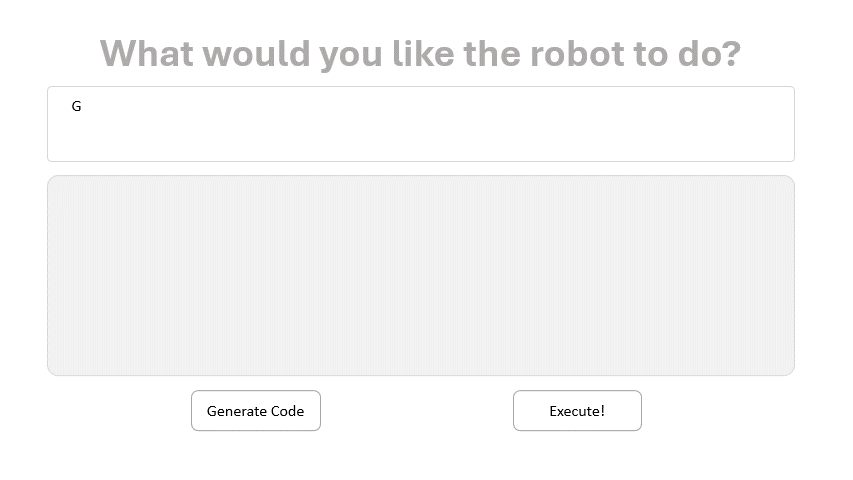

# Update Logs
1. support VLLM
```bash 
python roboeval_vllm -m {hf_model_name}
```
Results will be saved under `eval_results/` by defaults.

# CodeBotler Overview

[](https://github.com/ut-amrl/robot_commands/actions)



CodeBotler is a system that converts natural language task descriptions into robot-agnostic programs that can be executed by general-purpose service mobile robots. It includes a benchmark (RoboEval) designed for evaluating Large Language Models (LLMs) in the context of code generation for mobile robot service tasks.

This project consists of two key components:
* [CodeBotler](#codebotler-deploy-quick-start-guide): This system features a web interface designed for generating general-purpose service mobile robot programs, along with a ROS (Robot Operating System) Action client for deploying these programs on a robot. It offers the flexibility to explore the code generation capabilities of CodeBotler in two ways: as a standalone system without a robot, as illustrated in the figure above, or by actual deployment on a real robot.


* [RoboEval](#roboeval-benchmark-quick-start-guide): This benchmark for code generation features a suite of 16 user task descriptions, each with 5 paraphrases of the prompt. It includes a symbolic simulator and a temporal trace evaluator, specifically designed to assess Large Language Models (LLMs) in their ability to generate code for service mobile robot tasks.

Project website: https://amrl.cs.utexas.edu/codebotler

## Requirements

We provide a conda environment to run our code. To create and activate the environment:
```shell
conda create -n codebotler python=3.10
conda activate codebotler
cd $WORKSPACE_ROOT
pip install -e .
```

**Language Model Options**
* To use an OpenAI model, you will need an [OpenAI key](https://platform.openai.com/account/api-keys), either saved in a file named `.openai_api_key`, or in the `OPENAI_API_KEY` environment variable.
* To use a Gemini model, you will need a [Google Generative API key](https://developers.generativeai.google/tutorials/setup), either saved in a file named `.gemini_api_key`, or in the `GEMINI_API_KEY` environment variable.
* You can use any pretrained model compatible with the [vLLM](https://docs.vllm.ai/en/latest/), including open-source models from the [HuggingFace repository](https://huggingface.co/models) such as [Starcoder2](https://huggingface.co/bigcode). Note that some models, including Starcoder2, require you to agree to the HuggingFace terms of use, and you must be logged in using `huggingface-cli login`.

## CodeBotler Deployment Quick-Start Guide

To run the web interface for CodeBotler-Deploy using the default options (using OpenAI's
`gpt-4` model), run:
```shell
python3 codebotler.py
```
This will start the server on `localhost:8080`. You can then open the interface
by navigating to http://localhost:8080/ in your browser.

List of arguments:
* `--ip`: The IP address to host the server on (default is `localhost`).
* `--port`: The port to host the server on (default is `8080`).
* `--ws-port`: The port to host the websocket server on (default is `8190`).
* `--model-type`: The type of model to use. It is either `openai` (default), `vllm`, or `gemini`.
* `--model-name`: The name of the model to use. Recommended options are
  `gpt-4` for GPT-4 (default), `gpt-4o-mini` for GPT4o-Mini, `gemini-2.0-flash` for Gemini-2.0-flash, and
  `deepseek-ai/DeepSeek-R1-Distill-Qwen-32B` for Deepseek-R1 Qwen Distilled version.
* `--robot`: Flag to indicate if the robot is available (default is `False`).
For more arguments, please refer to the python file.

Instructions for deploying on real robots are included in [robot_interface/README.md](robot_interface/README.md).

## RoboEval Benchmark Quick-Start Guide

The instructions below demonstrate how to run the benchmark using the open-source [starcoder2-7b](https://huggingface.co/bigcode/starcoder2-7b) model.


1. Run code generation for the benchmark tasks using the following command:
    ```shell
    python3 roboeval.py -mt vllm -m bigcode/starcoder2-7b -temp 0 -num 1 -tps 2
    ```
    Arguments:
    - mt: Model type (e.g., vllm)
    - m: Model name (e.g., bigcode/starcoder2-7b)
    - temp: Sampling temperature (e.g., 0 for deterministic output)
    - num: Number of completions to generate per prompt (e.g., 1)
    - tps: Tensor parallel size — number of GPUs to use (only used for model type vllm)

2. After generation, results are saved by default to the `eval_results/` directory (you can modify it by providing an argument `-sd DIRECTORY` ):
```
eval_results
└── pass1/           # Directory containing pass@1 
├── error_breakdown/ # Breakdown of errors during 
└── programs.json    # Generated programs
```

3. Finally, you can compute pass@1 score for every task:
    ```shell
    python3 compute_pass1.py --dir ROBOEVAL_GENERATION_SAVED_DIR
    ```
