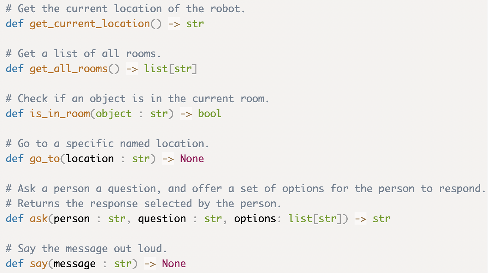
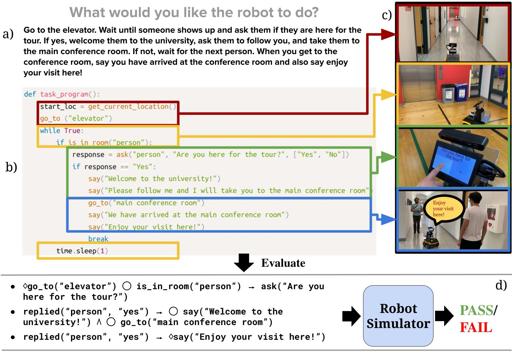
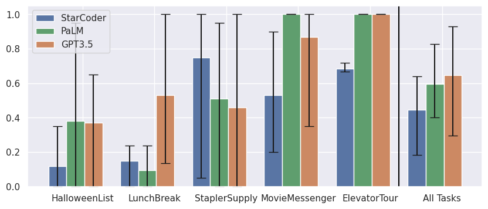

# Abstract
Recent advancements in large language models (LLMs) have spurred interest in using them for generating robot programs from natural language, with promising initial results.  We investigate the use of LLMs to generate programs for service mobile robots leveraging mobility, perception, and human interaction skills, and where accurate sequencing and ordering of actions is crucial for success.  We contribute **CodeBotler**, an open-source tool to program service mobile robots from natural language, and **RoboEval**, a benchmark to evaluate the correctness and robustness of generated programs. CodeBotler performs program generation via few-shot prompting of LLMs with an embedded domain-specific language (eDSL) in Python, and leverages skill abstractions to deploy generated programs on any general-purpose mobile robot.  RoboEval evaluates the correctness of generated programs by first generating execution traces starting with multiple world initial states, and then checking whether each of the traces satisfy temporal logic properties that encode correctness for each task.  RoboEval also includes multiple prompts per task to test for robustness of program generation. 

# Overview

**CodeBotler** is an open-source tool to generate general-purpose service robot programs from natural language, and to deploy such programs on general-purpose autonomous mobile robots. It performs program generation with an _embedded domain-specific language_ (eDSL) in a programming
language that LLMs are already adept in: Python. By abstracting robot
skills in the eDSL, we release CodeBotler, a robot-agnostic deployment
system for executing generated programs on any general-purpose mobile robot. By
embedding the eDSL in Python, CodeBotler drastically reduces the number of
syntax and run-time errors of generated code. 
The list of robot skills abstracted in the eDSL is shown below:

**RoboEval** is a code completion benchmark that tests for both correctness and robustness of LLM-generated robot programs. This proposed benchmark 1) evaluates the *execution traces* of programs; 2) checks whether the execution traces satisfy *temporal logic* properties that encode correctness for each task; and 3) *varies the prompts* for each task to test for robustness of generated programs.

CodeBotler converts a) natural language task prompts into b) python programs leveraging robot skill abstraction, and c) executes the programs on a real robot. d) RoboEval verifies results via LTL checking of simulation traces.

# RoboEval

**RoboEval Benchmark**   
The preliminary RoboEval benchmark consists of 5 tasks:
- `HalloweenList`: Go to every office, and if there is anyone there, ask if they'd like a chocolate, caramel, or gummy. Come back and tell me how many of each we need to buy.
- `LunchBreak`: Ask if Alice and Bob in their offices are up for lunch. If yes, tell them that we'll meet in the lobby in 5 minutes. Come back and tell me who all are joining for lunch.
- `StaplerSupply`: Check every printer room for a stapler, and come back and tell me which ones do not have a stapler.
- `MovieMessenger`: Ask Sally in her office if she wants to go to the cinema with Mark. Go to Mark's office and tell him Sally's answer. If Sally says yes, ask Mark whether he wants to leave at 4PM, 5PM, or 6PM - then go tell Sally what time Mark is leaving.
- `ElevatorTour`: Go to the elevator. Wait until someone shows up and ask them if they are here for the tour. If yes, welcome them to the university, ask them to follow you, and take them to the main conference room. If not, wait for the next person. When you get to the conference room, say you have arrived at the conference room and also say enjoy your visit here!

**Prompt Variations**   
RoboEval also includes __multiple prompts__ per task, to test for robustness. Here are the prompts for the `HalloweenList` task:
- `HalloweenList-0`: Go to every office, and if there is anyone there, ask if they'd like a chocolate, caramel, or gummy. Come back and tell me how many of each we need to buy.
- `HalloweenList-1`: Go to every office, and if there is a person there, ask them if they'd like a chocolate, caramel, or gummy. Come back and tell me how many of each we need to buy.
- `HalloweenList-2`: Check with every occupied office to see if the occupant would like a chocolate, caramel, or gummy. Let me know how many of each we need to buy.
- `HalloweenList-3`: Find every occupied office and ask their occupants whether they would like a chocolate, caramel, or gummy. Let me know how many of each we need to buy.
- `HalloweenList-4`: Go to every office with a person, and ask them if they would like a chocolate, caramel, or gummy, then come back and tell me how many of each people asked for.

The preliminary RoboEval benchmark thus consists of 25 prompts in total (5 tasks
x 5 prompts per task), with temporal checks for each task, and multiple initial world
states for checking correctness against each task.

**Preliminary RoboEval Results**   
We evaluated the correctness and robustness of generated programs for the 5 tasks
in RoboEval using the following LLMs:
- **[StarCoder](https://huggingface.co/bigcode/starcoder)** (`bigcode/starcoder`):
  An open-source 15.5B parameter LLM trained on 80+ programming languages from [The Stack](https://huggingface.co/datasets/bigcode/the-stack).
- **[PaLM 2](https://developers.generativeai.google/models/language)** (`text-bison-001`): A proprietary LLM from Google with multiple capabilities, including code generation.
- **[GPT3.5](https://platform.openai.com/docs/models/gpt-3-5)** (`text-davinci-003`): A proprietary LLM from OpenAI capable of general language tasks, including code generation.

We generated 20 program completions per task per LLM for evaluation, for a total of 5x5x20=500 completions per LLM.
We evaluated the pass@1 rates for every prompt, and report the mean pass@1 rate for each task (over all prompt varations per task), along with the min and max pass@1 rates over all prompts for the same task. The results are then aggregated over all tasks by computing the mean, average min, and average max pass@1 rates over all tasks.
We draw the following conclusions from the results:
- None of the programs generated by GPT3.5 and PaLM 2 had any Python errors, while 25/500 programs (5% completions) generated by StarCoder resulted in run-time errors.
- Over all tasks, GPT3.5 performed the best, with an average pass@1 rate of 64.7%, followed by PaLM 2 (pass@1 rate of 59.7%), and StarCoder (pass@1 rate of 44.6%).
- Varying the prompt for each task resulted in significant changes in pass@1 rates for all LLMs. For example, the pass@1 rate for the `StaplerSupply` task varied from near-0 pass@1 rate to near-100% pass@1 rate for all LLMs, depending on the prompt.

pass@1 results for PaLM (`text-bison-001`), StarCoder, and GPT3.5 (`text-davinci-003`) - errorbars show variations resulting from rephrasing task prompts.

# CodeBotler Demo