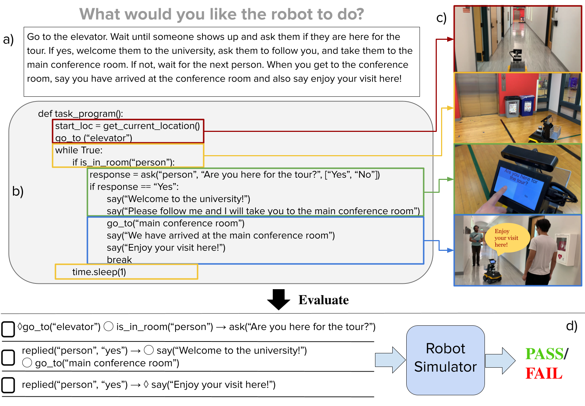

<h5><strong>code</strong></h5>

<h5><strong>paper</strong></h5>

# Abstract
Recent advancements in the capabilities of large language models (LLMs) have
spurred interest in using them for generating robot task policies from natural
language task descriptions. Early
results indicate that LLMs are
indeed capable of generating reasonable task policies. However, such initial
promise has been tempered by results showing that 1) LLMs frequently generate
imprecise results that are not executable, and 2) large-scale testing and
evaluation has been hindered by the lack of existing benchmarks. We contribute
to address both these issues.

# Overview

Add some text descriptions here
# Demo
* INSERT Video Here